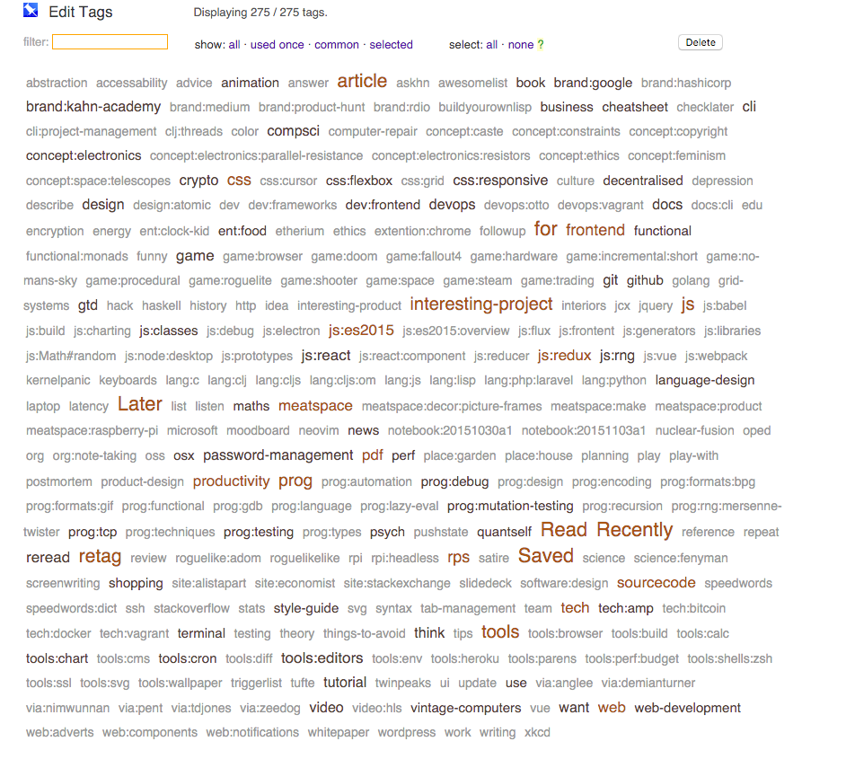

# Pinboard Tag Editor

So, [pinboard](https://pinboard.in) is a thing. It's an awesome thing, and since
I started using it I've gone back and hunted down links that otherwise would
have been lost forever.

I also use it as a reference system in my notebooks where,
instead of generating shorturls, I add a tag onto the URL and mention the tag in
my notebook - allowing any number of links to be associated with some writing
with little hastle. Especially since I'll most likely have added the link to
pinboard anyway.

As wonderful as it is, there are some aspects of tag management that I just wish
were easier. Tags are the primary way in which I interact with my links, and I
like to keep them fairly tightly curated. I sort my tags into groups, with
sub-groups, something like the following:

```
concept:electronics:resistors
```

Where left to right we see least specific to most specific, using colons as
separators. Spaces are converted to dashes, also. This is a pretty ad-hoc
system, with a little bit of maintainance required on occasion to make sure it
doesn't get too wild - but it works.

Now that's out of the way, onto the problem...

## The Problem.

There are a couple of pieces to this. Firstly, searching through tags. Secondly,
editing existing tags.

### Searching Through Tags

As mentioned earlier, my primary interaction with my saved links is through the
tag interface, seen here:



The filter is usually how I narrow down what I'm looking for, but currently I
have to remember the tag from start to end. Using the previously mentioned
`concept:electronics:resistors` tag, I wouldn't be able to search for
`electronics` and find it, I would have to start  with `concept`. While in this
case, I know that this tag begins with concept, that may not always be the case.
However, I do not want to remove the context that the starting words like
`concept` add. Fuzzy search for my tags would also be ideal.

### Editing Existing Tags

This is related to the previous point tangenitally. Suppose I forget that I have
a `concept:electronics` tag, and start just an `electronics` tag (which may be
the case, if I start tagging enough electronics stuff). When I did my nice fuzzy
search for `electronics` I'd find both tags. This is the way articles get lost.
I'd love a UI interface for changing that `electronics` into
`concept:electronics` - or visa versa. There is an API endpoint for doing just
this, but no way of handling it via the pinboard website.

### Additive filters

Another thing that I would find hugely useful is additive filters. For example,
if I needed to find a functional programming language I remember reading about,
I could apply both the filter 'lang' and 'prog:functional' and I'd find an
intersection of links there. This may be for later, as it contradicts what I say
below about not caring about seeing the articles associated. Since it relies on
fuzzy search of tags, I can't just fob this action off on the current pinboard
site. Perhaps if everything else goes well?


### Things I don't want to lose

* The nice, quick overview where I can see all or most of my tags in one go
* The indication of usage frequency or importance displayed by pinboard

### Things I don't mind about

* being able to see the articles associated with these tags in situ - I expect a
  link to them in pinboard, but I have no desire to build a full-fledged
  pinboard client.


## The Solution

I'd like to create a mini-desktop-app that would allow me to manage my tags
completely separately from the rest of the pinboard site. I could search for
tags, get the links to the tags I find on the pinboard website itself, and
manage tags in a way conducive to how I work. I may also be able to build up
some views on how I interact with tags, as well as custom views of the heirarchy
of my tags and tagging system.

## First Steps

* [ ] quick and dirty interface for talking to any relevant pinboard api
  functions.
